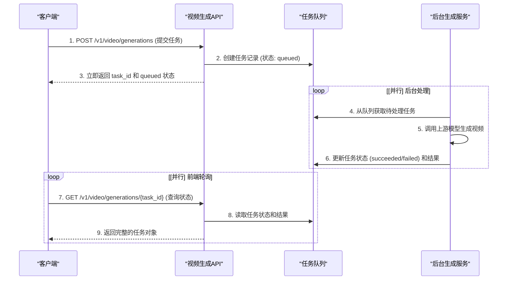

# 视频生成 API 设计文档

## 1. 设计背景

*   **缺乏统一标准**：当前各视频生成大模型厂商提供的 API 接口格式差异很大，没有统一的调用规范。不同厂商（如可灵、即梦、Vidu, Sora, RunwayML,OpenAI Sora、Google Veo、Runway Gen-3/4、可灵 Kling、Pika Labs、腾讯混元、阿里通义万相等）的视频生成接口各不相同。
*   **设计目标**：本接口旨在抽象出通用的调用格式，兼容当前和未来多家视频大模型厂商的能力。
*   **参考 OpenAI/Azure 风格**：为保证兼容性和开发者友好性，本接口在设计上尽量参考了 **OpenAI** 的 API 风格与 **Azure AI** 的异步任务模式。我们采用 `/v1/video/generations` 路径来管理异步任务，通过提交任务获取 `task_id`，再通过轮询查询任务状态和结果。

## 2. 接口设计

### 接口路径

*   **创建视频生成任务**：
    ```
    POST /v1/video/generations
    ```

*   **查询任务状态与结果**：
    ```
    GET /v1/video/generations/{task_id}
    ```

### 请求参数说明

| 参数名 | 类型 | 是否必需 | 说明 |
| --- | --- | --- | --- |
| `model` | 字符串 | 必需 | 指定调用的视频模型ID，例如 `"kling-v2-master"` 或 `"sora-1"`。 |
| `prompt` | 字符串 | 可选 | 文本提示词，用于描述生成视频的内容。 |
| `image` | 字符串（URL/Base64） | 可选 | 图像输入，可作为视频首帧或灵感图。 |
| `duration` | 数值（秒） | 必需 | 期望的视频时长（秒）。例如 `5.0` 表示 5 秒。 |
| `width` | 整数 | 必需 | 视频宽度（像素）。 |
| `height` | 整数 | 必需 | 视频高度（像素）。 |
| `fps` | 整数 | 可选 | 视频帧率。若不填写，则使用模型默认值。 |
| `n` | 整数 | 可选 | 要生成的视频数量。默认为 `1`。 |
| `seed` | 整数 | 可选 | 随机种子，用于结果复现。 |
| `response_format` | 字符串 | 可选 | 生成结果的返回格式：`"url"` 返回视频链接（默认），`"b64_json"` 返回 Base64 编码数据。 |
| `user` | 字符串 | 可选 | 代表终端用户的唯一标识符，可用于监控和检测滥用行为。 |
| `metadata` | 对象 (JSON) | 可选 | 元数据，用于透传不同厂商的自定义或非通用参数（如 negative_prompt、style、quality_level、mode 等）。 |

### 示例请求 JSON

*   POST: `/v1/video/generations`
*   Content-Type: `application/json`

```json
{
  "model": "kling-v2-master",
  "prompt": "在山间日出时分，飞鸟展翅的动画场景。",
  "negative_prompt": "模糊, 低质量",
  "image": "https://example.com/first_frame.png",
  "duration": 5.0,
  "width": 1920,
  "height": 1080,
  "n": 1,
  "user": "user-1234",
  "response_format": "url",
  "seed": 20240729,
  "metadata": {
    "style": "写实",
    "quality_level": "standard"
  }
}
```

### 响应结构说明

#### 1. 创建任务的响应

调用 `POST` 接口后，系统会立即返回一个任务对象，表示任务已进入队列。

```json
{
  "id": "task_abcd1234efgh",
  "object": "video.generation.task",
  "status": "queued",
  "created_at": 1722238800,
  "model": "kling-v2-master",
  "prompt": "在山间日出时分，飞鸟展翅的动画场景。"
}
```

#### 2. 查询任务的响应

通过 `GET` 接口轮询任务，会返回完整的任务对象。

| 字段名 | 类型 | 说明 |
| --- | --- | --- |
| `id` | 字符串 | 任务的唯一标识符 (`task_id`)。 |
| `object` | 字符串 | 对象类型，固定为 `"video.generation.task"`。 |
| `status` | 字符串 | 任务状态：`"queued"` (排队中), `"processing"` (处理中), `"succeeded"` (成功), `"failed"` (失败)。 |
| `created_at` | 整数 | 任务创建时间的 Unix 时间戳。 |
| `finished_at` | 整数 \| null | 任务完成时间的 Unix 时间戳，未完成时为 `null`。 |
| `failure_reason` | 字符串 \| null | 任务失败的原因描述，成功时为 `null`。 |
| `result` | 对象 \| null | 当 `status` 为 `"succeeded"` 时，此字段包含生成结果。 |
| `prompt` | 字符串 | 原始的文本提示词。 |
| `model` | 字符串 | 使用的模型 ID。 |

#### 3. 成功结果 (`result`) 结构

| 字段名 | 类型 | 说明 |
| --- | --- | --- |
| `object` | 字符串 | 对象类型，固定为 `"list"`。 |
| `data` | 数组 | 包含一个或多个视频生成结果对象的数组。 |
| `data`.`object` | 字符串 | 对象类型，固定为 `"video.generation"`。 |
| `data`.`url` | 字符串 | 生成视频的 URL 链接（当 `response_format` 为 `"url"`）。 |
| `data`.`b64_json` | 字符串 | Base64 编码的视频数据（当 `response_format` 为 `"b64_json"`）。 |
| `data`.`seed` | 整数 | 生成该视频所用的随机种子。 |
| `data`.`format` | 字符串 | 视频文件格式，例如 `"mp4"`。 |

### 示例响应 JSON

**处理中:**

```json
{
  "id": "task_abcd1234efgh",
  "object": "video.generation.task",
  "status": "processing",
  "created_at": 1722238800,
  "finished_at": null,
  "failure_reason": null,
  "result": null,
  "prompt": "在山间日出时分，飞鸟展翅的动画场景。",
  "model": "kling-v2-master"
}
```

**处理成功:**

```json
{
  "id": "task_abcd1234efgh",
  "object": "video.generation.task",
  "status": "succeeded",
  "created_at": 1722238800,
  "finished_at": 1722238920,
  "failure_reason": null,
  "result": {
    "object": "list",
    "data": [
      {
        "object": "video.generation",
        "url": "https://cdn.example.com/videos/abcd1234efgh.mp4",
        "b64_json": null,
        "seed": 20240729,
        "format": "mp4"
      }
    ]
  },
  "prompt": "在山间日出时分，飞鸟展翅的动画场景。",
  "model": "kling-v2-master"
}
```

### 错误结构格式

若请求参数错误或接口调用失败，返回标准的错误信息：

```json
{
  "error": {
    "code": 400,
    "message": "Invalid prompt or parameters",
    "type": "invalid_request_error"
  }
}
```

## 3. 系统工作流程

视频生成采用**前后端分离的异步任务**模式。

### 流程序列图



## 4. 使用示例

#### 1. 创建视频生成任务

```bash
curl -X POST "http://localhost:3000/v1/video/generations" \
  -H "Content-Type: application/json" \
  -H "Authorization: Bearer sk-your-api-key" \
  -d '{
    "model": "kling-v2-master",
    "prompt": "一只戴着墨镜的猫在爵士酒吧弹钢琴。",
    "duration": 5.0,
    "width": 1024,
    "height": 1024
  }'
```

**响应示例：**
```json
{
  "id": "task_abcd1234efgh",
  "object": "video.generation.task",
  "status": "queued",
  "created_at": 1722238800,
  "model": "kling-v2-master",
  "prompt": "一只戴着墨镜的猫在爵士酒吧弹钢琴。"
}
```

#### 2. 查询任务状态

```bash
curl -X GET "http://localhost:3000/v1/video/generations/task_abcd1234efgh" \
  -H "Authorization: Bearer sk-your-api-key"
```

**最终成功响应示例：**
```json
{
  "id": "task_abcd1234efgh",
  "object": "video.generation.task",
  "status": "succeeded",
  "created_at": 1722238800,
  "finished_at": 1722238920,
  "failure_reason": null,
  "result": {
    "object": "list",
    "data": [
      {
        "object": "video.generation",
        "url": "https://cdn.example.com/videos/abcd1234efgh.mp4",
        "b64_json": null,
        "seed": 20240729,
        "format": "mp4"
      }
    ]
  },
  "prompt": "一只戴着墨镜的猫在爵士酒吧弹钢琴。",
  "model": "kling-v2-master"
}
```
> 参考资料: 
> * [Azure AI - 快速入門：使用 Sora 產生影片](https://learn.microsoft.com/zh-tw/azure/ai-services/openai/video-generation-quickstart?tabs=windows%2Ckeyless)
> * [可灵 AI API 接口文档](https://docs.qingque.cn/d/home/eZQAyImcbaS0fz-8ANjXvU5ed?identityId=1oEG9JKKMFv)